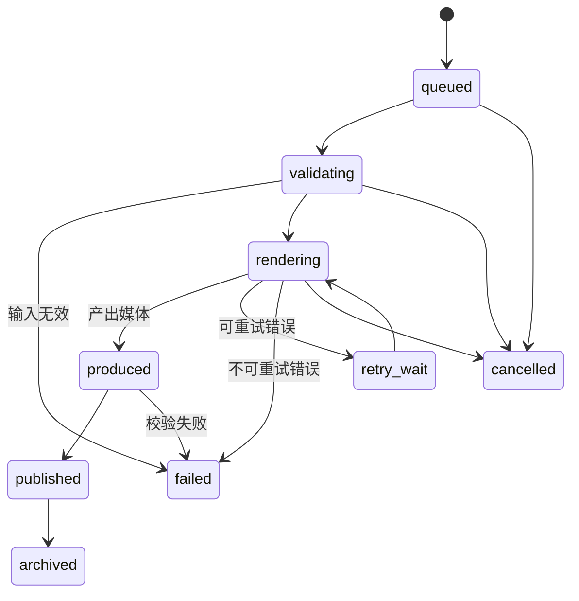

# RenderJob 状态机

每个任务包含 `id`、`kind`、`inputAssetIds`、`rendererId`、`rendererVersion`、`status`、`progress`、`errorCode`、`attempt`、`createdAt` 和 `updatedAt`。渲染器不得直接修改业务表，只能提交事件和媒体产物；这样音频实现可以替换成视频或 3D 手指同步实现，而不会改变信件和歌单模型。

## 渲染器接口方向

- `AudioRenderer`: MIDI -> WAV/MP3 + timing manifest。
- `VideoRenderer`: audio + scene -> MP4/WebM + manifest。
- `Future3DRenderer`: MIDI + timing manifest + character rig -> hand/camera/action tracks。

`timing manifest` 保存音符、踏板、节拍和渲染时间轴，是后续实现精确手指同步的稳定扩展点。
