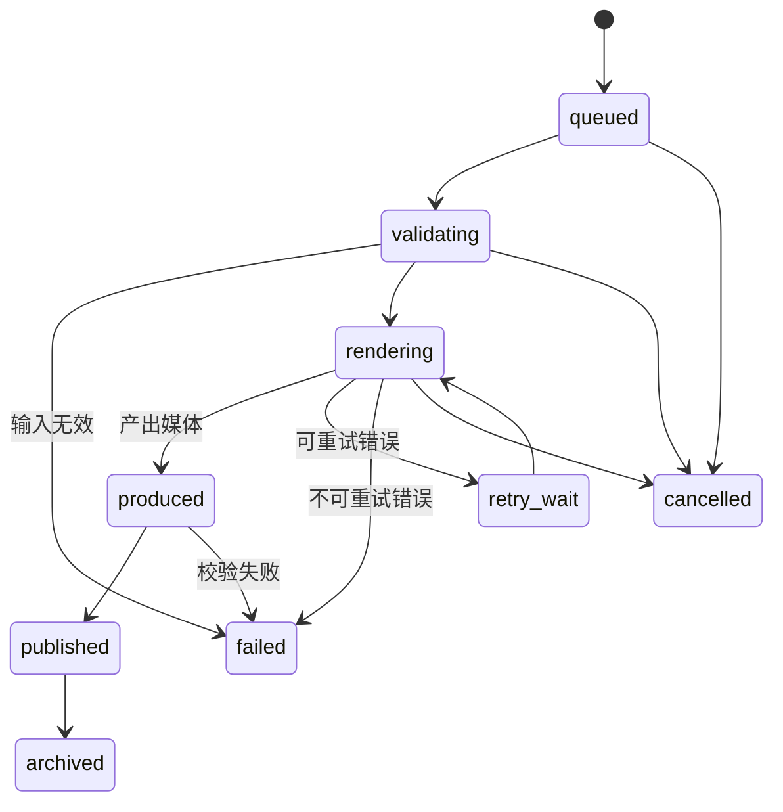

# RenderJob 状态机

每个任务包含 `id`、`kind`、`inputAssetIds`、`rendererId`、`rendererVersion`、`status`、`progress`、`errorCode`、`attempt`、`createdAt` 和 `updatedAt`。渲染器不得直接修改业务表，只能提交事件和媒体产物；这样音频实现可以替换成定制演奏视频或 3D 手指同步实现，而不会改变信件和歌单模型。文字回信、视频回信和定制演奏可以共用这套任务生命周期，但由各自的领域服务负责输入和业务状态。

## 当前 MIDI 任务与游戏状态的对应

Phase 4-1/4-2 复用 RenderJob，但领域 `state`、RenderJob `status` 和游戏数字状态分开保存/转换，不能混用：

| MIDI `state` | RenderJob `status` | 0.0.9.627 游戏 `state` |
| --- | --- | --- |
| `queued` | `queued` | 1 |
| `processing` | `validating` / `rendering` | 2 |
| `finished` | `produced` | 3 |
| `canceled` | `cancelled` | 4 |
| `failed` | `failed` | 5 |

映射由 `src/gateway/midi-compat.js` 负责，仍兼容旧 `pending/running`。当前 MIDI 成功终点是 `produced`，已有视频资产导入才继续走 `published`，不能为对齐图示强行改写业务状态。恢复和协作式取消见 [Phase 4-1](./phase4-1-music-settings-and-media.md)；视频自动生成属于 Phase 6。

## 渲染器接口方向

- `AudioRenderer`: MIDI -> WAV/MP3 + timing manifest。
- `VideoRenderer`: 定制演奏的 audio + scene -> MP4/WebM + manifest。
- `VideoGenerator`: 视频回信上下文 + 角色/场景/音频输入 -> 视频回信 MP4/WebM + manifest；它与 `videoImporter` 完全分离。
- `Future3DRenderer`: MIDI + timing manifest + character rig -> hand/camera/action tracks。

`VideoGenerator` 必须通过独立注册表选择实现。第一版可以提供确定性的本地 fallback，用于验证排队、处理中、成功、失败、取消、重启恢复、媒体保存、格式检查和查询；它只验证技术链路，不代表已经达到正式视频回信的角色表现质量。

`timing manifest` 保存音符、踏板、节拍和渲染时间轴，是后续实现精确手指同步的稳定扩展点。

## 2026-09-11 验收收尾

当前实现已在 Steam `0.0.9.627` 中复验 MIDI `produced` 到原生演奏、预设歌单回填后的播放，以及已有视频资产的播放。`RenderJob` 仍只描述任务生命周期：合成视频数据的成功播放不等于 `VideoGenerator` 已实现，定制演奏和视频自动生成仍需各自的生成器与质量验收。
