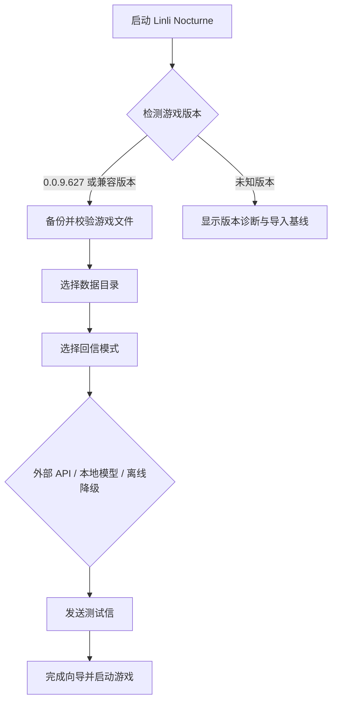

# 普通用户流程

## 首次启动

## 写信

1. 用户在游戏中打开写信入口。
2. LocalGateway 接收并写入 SQLite 队列。
3. LetterService 根据规则检查每日额度和五分钟延迟。
4. ModelAdapter 选择外部 API、本地模型或离线模板引擎。
5. 回信文字先落库，再由 MediaStore 关联视频、音频或图片。
6. 游戏轮询状态并展示已完成回信；失败任务可重试。

## MIDI

1. 用户选择 `.mid` 文件，向导提示大小、音轨和时长。
2. MusicService 校验 MIDI、解析音符与延音踏板，并生成预览。
3. RenderJob 先执行 AudioRenderer，产出本地音频和动态背景播放结果。
4. 后续可选择 VideoRenderer 或 Future3DRenderer；渲染器通过同一任务协议接入。
5. 用户将结果加入歌单，原文件、派生媒体和任务日志均可备份。

## 安全和可恢复性

- API Key 只保存在本机凭据存储或用户指定的加密配置中。
- 每次补丁前创建清单和备份；失败自动回滚。
- 删除信件和媒体默认进入回收站，用户确认后才永久清理。
