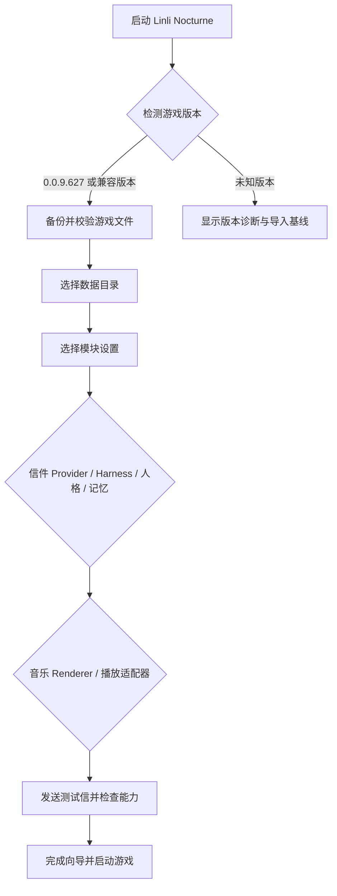

# 普通用户流程

## 首次启动

## 写信

1. 用户在游戏中打开写信入口。
2. LocalGateway 接收并写入 SQLite 队列。
3. LetterService 根据规则检查每日额度和五分钟延迟。
4. ModuleSettings 根据用户选择让 ModelAdapter 使用外部 API、本地模型、Harness 或离线模板引擎；人格和记忆也从对应 provider 读取。
5. 回信文字先落库，再由 MediaStore 关联视频、音频或图片。
6. 游戏轮询状态并展示已完成回信；失败任务可重试。

## 玩家与记忆管理

停止服务后运行 `node scripts/manage-user-data.mjs`，按编号创建/切换玩家、修改称呼、查看记忆、遗忘或重新纳入旧信。迁移时旧电脑导出一个 ZIP，新电脑导入；程序负责校验、原数据备份和路径恢复，用户填写模型密钥后启动服务。新模板默认选择持续记忆，修改名字不改变 profileId。

## MIDI

1. 用户选择 `.mid` 文件，向导提示大小、音轨和时长。
2. MusicService 校验 MIDI、解析音符与延音踏板，并生成预览。
3. ModuleSettings 选择 AudioRenderer、VideoRenderer、Future3DRenderer 或其他已注册实现。
4. GamePlaybackAdapter 把统一曲目中间表示转换为具体游戏或播放器的输入格式。
5. 用户将结果加入歌单，原文件、派生媒体和任务日志均可备份。

## 安全和可恢复性

- API Key 保存在 Git 忽略的本机 `config/user-config.json` 或环境变量中；当前 JSON 不提供加密，不随数据包导出。
- 每次补丁前创建清单和备份；失败自动回滚。
- 删除信件和媒体默认进入回收站，用户确认后才永久清理。
