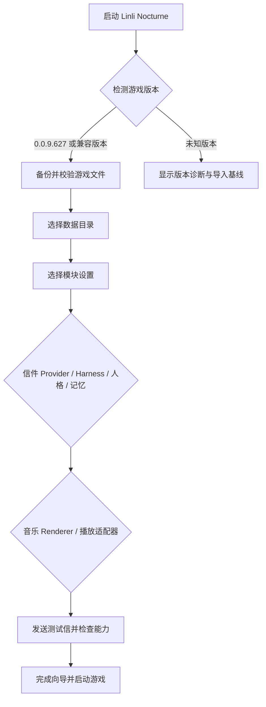

# 普通用户流程

## 首次启动（Phase 7 目标流程）

下图是最终安装向导的设计，并非当前全部可用。开发版实际使用流程见 [README 用户配置指南](../README.md#用户配置指南)，配置文件及终端向导见 [user-config.md](./user-config.md)；首次原版安装仍有[补丁整合缺口](./original-installation.md#当前交付边界2026-09-09)。

## 写信

1. 用户在游戏中打开写信入口。
2. LocalGateway 接收并写入 SQLite 队列。
3. LetterService 根据规则检查每日额度和五分钟延迟。
4. ModuleSettings 根据用户选择让 ModelAdapter 使用外部 API、本地模型、Harness 或离线模板引擎；人格和记忆也从对应 provider 读取。
5. 回信文字先落库，再由 MediaStore 关联视频、音频或图片。
6. 游戏轮询状态并展示已完成回信；失败任务可重试。

## 玩家与记忆管理

停止服务后运行 `node scripts/manage-user-data.mjs`，按编号创建/切换玩家、修改称呼、查看记忆、遗忘或重新纳入旧信。迁移时旧电脑导出一个 ZIP，新电脑导入；程序负责校验、原数据备份和路径恢复，用户填写模型密钥后启动服务。新模板默认选择持续记忆，修改名字不改变 profileId。

## MIDI

1. 用户选择 `.mid` 文件，向导提示大小、音轨和时长。
2. MidiJobService 保存输入并创建排队任务，通过已有 MIDI 解析器、Renderer 和 Encoder 生成音频媒体；游戏轮询处理中、成功、失败或取消结果。
3. 用户通过配置文件或终端向导选择现有 Renderer、PlaybackAdapter 和 Encoder，重启本地服务后生效；视频生成及 3D Renderer 是后续能力，游戏内没有这类选择页。
4. GamePlaybackAdapter 转换游戏曲目字段；原生适配器配合 NativeUgcMediaStore 把生成媒体镜像到游戏所需目录。
5. 完成曲目进入“我的上传”，可试听、演奏、加入歌单；重复加入不产生重复项，移出歌单保留上传曲目。当前上传曲目演奏为黑屏和声音，人物与琴键同步画面留给 Phase 5。

Phase 4-1 至 4-4 已在 0.0.9.627 验收。2026-09-11 的实验分支收尾又确认预设曲目加入歌单后的名称、时长、音符占位和演奏，以及上传 MIDI、第四套在线写信和三条合成视频回信播放。试听独立于底部演奏栏；预设试听使用已下载且命名受支持的缓存，覆盖范围见 [Phase 4-2](./phase4-2-library-playlist-and-module-entry.md)。下一步是外部音乐导入调研与设计，之后再做宽松演奏和 Phase 4 总验收。

## 安全和可恢复性

- API Key 保存在 Git 忽略的本机 `config/user-config.json` 或环境变量中；当前 JSON 不提供加密，不随数据包导出。
- 每次补丁前创建清单和备份；失败自动回滚。
- 统一回收站是后续恢复流程的目标，当前不能承诺所有删除均可撤销；歌单移除不删除上传曲目，MIDI 删除会清理任务与生成媒体，已有视频资产删除只解除关联并保留旧文件。
